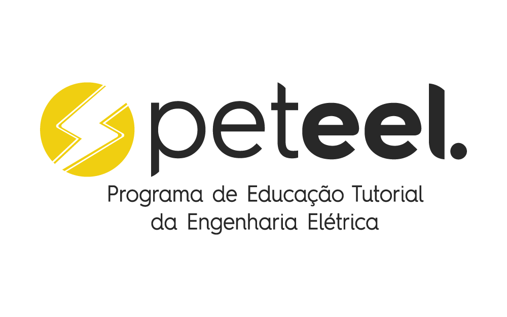

# Simulador de Circuitos Digitais

---
## Pet**eel**

[PET EEL](http://www.peteel.ufsc.br) is group of studants from tecnology courses of our university, promoted by the Federal governement, we work in the academic sector in the university labs and intern projects. Find out more at our site www.peteel.ufsc.br.

## About the Project
#### Authors:

This project has been developed by the studants Davi Grumiche Seemann, Eletrical Engeneering undergrad studant, [github](https://github.com/daviseemann) / [Linkedin](https://www.linkedin.com/in/daviseemann), and Miguel Boing, Eletronic Engeneerig undergrad studant, [github](https://github.com/miguelboing) / [Linkedin](https://www.linkedin.com/in/miguel-b%C3%B6ing-6aaba11b5/), both at [Universidade Federal de Santa Catarina](https://www.ufsc.br)
#### Motivation
As PET EEL freshmans we want to impact our academic community in a positive way.

#### Purpose
The main purpose of this project is to help people from the circuit subjects, with the objective to simulate how the logic gates work. Bringing theory to pratice in a simple way.

## Requirements

### Python (version3.5 or newer):

The easiest way to download and install python it's by [Anaconda Enviroment.](https://www.anaconda.com/)  
[Anaconda 64bit](https://repo.anaconda.com/archive/Anaconda3-2020.07-Windows-x86_64.exe)  
[Anaconda 32bit](https://repo.anaconda.com/archive/Anaconda3-2020.07-Windows-x86.exe)

### Kivy (version 1.11.1 or newer):
After installing anaconda you need to open the **Anaconda prompt** and execute the following commands:

    pip uninstall -y kivy.deps.glew kivy.deps.gstreamer kivy.deps.sdl2 kivy.deps.angle**  

    pip install --upgrade pip wheel setuptools virtualenv  
    pip install docutils pygments pypiwin32 kivy_deps.sdl2==0.1.* kivy_deps.glew==0.1.*  

    pip install kivy_deps.angle==0.1.*  

    pip install kivy==1.11.1

**It's done! Any doubts search in [kivy site.](https://kivy.org/#download)**

## Project development

To be done (soon).

## Pet**eel**
[PET EEL](http://www.peteel.ufsc.br) é um grupo de estundantes dos cursos de engenharia elétrica e engenharia eletrônica incentivado pelo governo federal. Nós trabalhamos com os laboratórios da universidade e também fazemos projetos internos. Descubra mais sobre no nosso site, www.peteel.ufsc.br.

## Sobre o Projeto

#### Autores:

Esse projeto foi desenvolvido pelos estudantes Davi Grumcihe Seemann, graduando de Engenharia Elétrica, [perfil do Github](https://github.com/daviseemann), e Miguel Boing, graduando de Engenharia Eletrônica, [perfil do github](https://github.com/miguelboing), ambos da [**Universidade Federal de Santa Catarina**](http://ufsc.br/).
#### Motivação
Como calouros do PET EEL queremos impactar nosso meio academico de maneira positiva.
#### Propósito
O propósito do projeto é ajudar estudantes do curso Circuitos, a fim de possibilitar uma simulação do funcionamento de portas lógicas. Trazendo a teoria para prática de maneira simples.

## Pré-requisitos

### Python (versão 3.5 ou mais nova):

A maneira mais simples de baixar python é pelo [Anaconda Enviroment.](https://www.anaconda.com/)  
[Anaconda 64bit](https://repo.anaconda.com/archive/Anaconda3-2020.07-Windows-x86_64.exe)  
[Anaconda 32bit](https://repo.anaconda.com/archive/Anaconda3-2020.07-Windows-x86.exe)

### Kivy (versão 1.11.1 ou mais nova):
Depois de instalar o Anaconda abra o **Anaconda prompt** e execute os estes comandos:

    pip uninstall -y kivy.deps.glew kivy.deps.gstreamer kivy.deps.sdl2 kivy.deps.angle**  

    pip install --upgrade pip wheel setuptools virtualenv  
    pip install docutils pygments pypiwin32 kivy_deps.sdl2==0.1.* kivy_deps.glew==0.1.*  

    pip install kivy_deps.angle==0.1.*  

    pip install kivy==1.11.1

**Qualquer duvida acesse o site do [kivy.](https://kivy.org/doc/stable/installation/installation-windows.html)**

## Desenvolvimento do projeto

A ser feito (em breve).
